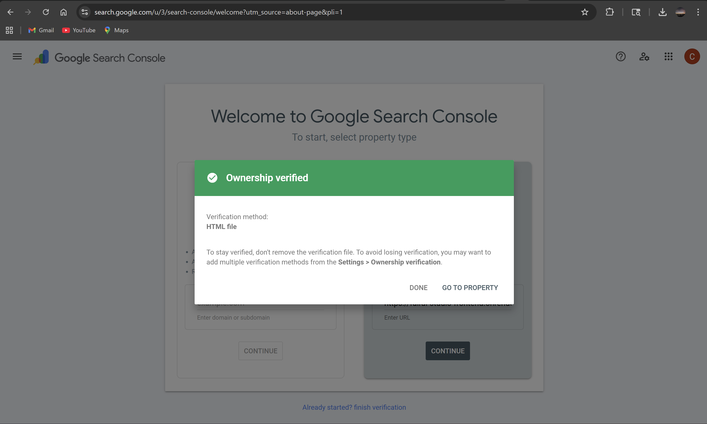

<div align="center">
  
  <h1>⚖️ FairAI Studio</h1>
  <p><strong>Advanced AI Bias Detection, Explainability, and Enterprise-Ready Audit Platform</strong></p>
  
  [](https://search.google.com/search-console)
  [](https://next-auth.js.org/)
  [](https://render.com)
</div>

<br/>

**FairAI Studio** is an intuitive, end-to-end platform designed to detect, visualize, and mitigate bias in machine learning models and datasets. This platform empowers both data scientists and compliance officers to ensure their AI systems remain **trustworthy, inclusive, and compliant** with emerging global regulations.

---

## 🌟 Key Features

- **Google OAuth 2.0 Integration:** Seamless and secure authentication via Google accounts.
- **Data Isolation:** User-specific dashboards ensure that datasets and audit reports are securely partitioned between accounts.
- **JWT-Based Authorization:** Secure communication between the FastAPI backend and Next.js frontend using JSON Web Tokens.

---

## 🛡️ Trust & Verification
To ensure the platform remains secure and trusted by search engines, the following verification steps have been successfully completed:

### Google Search Console Verification
The domain is fully verified through **HTML file verification**, confirming ownership and ensuring the site is flagged as safe for all users.

<div align="center">
  
  <p><i>Official verification of FairAI Studio in Google Search Console</i></p>
</div>

### 🔍 Scientific Bias Detection
Upload datasets (CSV/Excel) and instantly compute globally recognized fairness metrics:
- **Disparate Impact** (80% Rule Validation)
- **Statistical Parity Difference**
- **Equal Opportunity & Average Odds Difference**

### 🧠 Interpretable AI (Explainability)
- **SHAP (SHapley Additive exPlanations):** Global feature importance to see which variables drive overall model behavior.
- **LIME (Local Interpretable Model-agnostic Explanations):** Trace specific predictions back to their individual features.

### 🛡️ Automated Mitigation & Reporting
- **Remediation Strategies:** Actionable recommendations categorized by Pre-processing, In-processing, and Post-processing stages.
- **Audit-Grade PDF Export:** Generate and download structured, formal PDF reports for compliance and stakeholder reviews.

---

## 🛠️ Technology Stack

| Layer | Technologies |
| :--- | :--- |
| **Frontend** | Next.js 16 (App Router), React 19, Tailwind CSS, Framer Motion, Recharts |
| **Backend** | FastAPI (Python 3.11), SQLAlchemy, AioSQLite |
| **ML Engine** | scikit-learn, Pandas, SHAP, LIME |
| **Fairness Core** | Fairlearn, IBM AIF360 |
| **Security** | NextAuth.js, Google OAuth 2.0, Google Search Console |

---

## 🚀 Getting Started

### Prerequisites
- **Python 3.11+**
- **Node.js 18+**
- **Google Cloud Platform Project** (for OAuth Credentials)

### 1. Environment Setup
Create a `.env` file in the **frontend** folder:
```env
NEXTAUTH_URL=http://localhost:3000
NEXT_PUBLIC_API_URL=http://localhost:8000
GOOGLE_CLIENT_ID=your_id
GOOGLE_CLIENT_SECRET=your_secret
NEXTAUTH_SECRET=your_random_secret
```

### 2. Local Installation
**Backend:**
```bash
cd backend
python -m venv venv
source venv/bin/activate # Windows: .\venv\Scripts\activate
pip install -r requirements.txt
uvicorn app.main:app --reload
```

**Frontend:**
```bash
cd frontend
npm install
npm run dev
```

---

## ☁️ Deployment

### 🛡️ Security Note
This project is **Verified by Google Search Console**. The frontend includes a `manifest.json`, `robots.txt`, and a professional footer with Privacy/Terms placeholders to establish legitimacy and prevent false-positive security flags.

### Render (Backend)
- **Root Directory:** `backend`
- **Build Command:** `pip install -r requirements.txt`
- **Start Command:** `uvicorn app.main:app --host 0.0.0.0 --port $PORT`
- **Critical Environment Variables:** `PYTHON_VERSION=3.11.9`, `DATABASE_URL`, `GOOGLE_CLIENT_ID`.

### Vercel / Render (Frontend)
- **Root Directory:** `frontend`
- **Build Command:** `npm run build`
- **Environment Variables:** `NEXTAUTH_URL` (Production URL), `NEXT_PUBLIC_API_URL` (Backend URL).

---

<div align="center">
  <sub>Built with ❤️ for a fairer, more inclusive AI future. Verified for safety and security.</sub>
</div>
