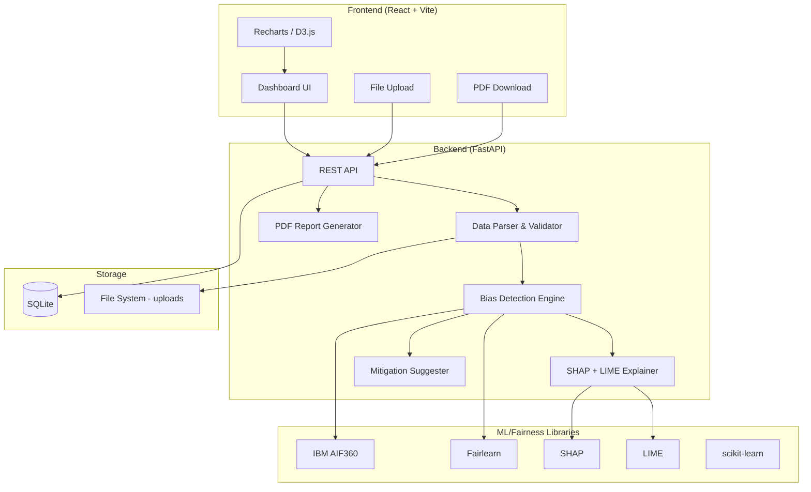

# Unbiased AI Decision Platform — Implementation Plan

A full-stack bias detection and fairness auditing platform that accepts datasets or ML models, scans for hidden bias across demographic groups, visualizes results, and suggests mitigation strategies.

---

## User Review Required

> [!IMPORTANT]
> **Tech Stack Confirmation**: The user specified React + Tailwind CSS. We'll use **Vite** (not Next.js) as the build tool since this is a single-page dashboard app, not an SSR site. Please confirm this is acceptable.

> [!IMPORTANT]
> **Database Choice**: For a hackathon/portfolio project, we'll use **SQLite** (via SQLAlchemy) instead of PostgreSQL to avoid external database setup. SQLite is file-based and zero-config. Confirm this is okay.

> [!WARNING]
> **SHAP + LIME Performance**: SHAP and LIME explanations are computationally expensive. For large datasets, we'll compute explanations on a sampled subset (configurable, default 100 rows) to keep response times reasonable.

> [!IMPORTANT]
> **PDF Report**: We'll use **ReportLab** (Python) for server-side PDF generation of audit reports. This avoids complex client-side PDF rendering.

---

## Architecture Overview



---

## Project Structure

```
d:\project\google hack part 2 - antigravity\
├── backend/
│   ├── app/
│   │   ├── __init__.py
│   │   ├── main.py                  # FastAPI app + CORS + lifespan
│   │   ├── config.py                # Settings & env vars
│   │   ├── database.py              # SQLAlchemy + SQLite setup
│   │   ├── models.py                # DB models (AuditReport, etc.)
│   │   ├── schemas.py               # Pydantic request/response schemas
│   │   ├── routers/
│   │   │   ├── __init__.py
│   │   │   ├── upload.py            # POST /api/upload — CSV upload
│   │   │   ├── analysis.py          # POST /api/analyze — run bias audit
│   │   │   ├── reports.py           # GET /api/reports — audit history
│   │   │   └── export.py            # GET /api/export/pdf/{id} — PDF download
│   │   ├── services/
│   │   │   ├── __init__.py
│   │   │   ├── data_parser.py       # CSV validation & parsing
│   │   │   ├── bias_detector.py     # AIF360 + Fairlearn metrics
│   │   │   ├── explainer.py         # SHAP + LIME explanations
│   │   │   ├── mitigator.py         # Bias mitigation suggestions
│   │   │   └── pdf_generator.py     # ReportLab PDF generation
│   │   └── utils/
│   │       ├── __init__.py
│   │       └── helpers.py           # Utility functions
│   ├── uploads/                     # Uploaded CSV files (gitignored)
│   ├── reports/                     # Generated PDF reports (gitignored)
│   ├── requirements.txt
│   └── .env
│
├── frontend/
│   ├── public/
│   ├── src/
│   │   ├── main.jsx
│   │   ├── App.jsx
│   │   ├── index.css                # Tailwind + global styles
│   │   ├── api/
│   │   │   └── client.js            # Axios instance + API functions
│   │   ├── components/
│   │   │   ├── layout/
│   │   │   │   ├── Sidebar.jsx
│   │   │   │   ├── Header.jsx
│   │   │   │   └── Layout.jsx
│   │   │   ├── upload/
│   │   │   │   ├── FileUpload.jsx
│   │   │   │   └── ColumnSelector.jsx
│   │   │   ├── dashboard/
│   │   │   │   ├── BiasScoreCard.jsx
│   │   │   │   ├── MetricsOverview.jsx
│   │   │   │   ├── FairnessRadar.jsx
│   │   │   │   └── GroupComparison.jsx
│   │   │   ├── charts/
│   │   │   │   ├── DisparateImpactChart.jsx
│   │   │   │   ├── EqualOpportunityChart.jsx
│   │   │   │   ├── ShapWaterfall.jsx
│   │   │   │   ├── FeatureImportance.jsx
│   │   │   │   └── BiasHeatmap.jsx
│   │   │   ├── explainability/
│   │   │   │   ├── ShapExplainer.jsx
│   │   │   │   └── LimeExplainer.jsx
│   │   │   ├── mitigation/
│   │   │   │   └── MitigationPanel.jsx
│   │   │   └── reports/
│   │   │       ├── ReportHistory.jsx
│   │   │       └── ReportDownload.jsx
│   │   ├── pages/
│   │   │   ├── UploadPage.jsx
│   │   │   ├── DashboardPage.jsx
│   │   │   ├── ExplainabilityPage.jsx
│   │   │   ├── MitigationPage.jsx
│   │   │   └── ReportsPage.jsx
│   │   ├── hooks/
│   │   │   ├── useAnalysis.js
│   │   │   └── useFileUpload.js
│   │   └── utils/
│   │       ├── constants.js
│   │       └── formatters.js
│   ├── package.json
│   ├── vite.config.js
│   ├── tailwind.config.js
│   └── postcss.config.js
│
├── sample_data/
│   └── german_credit.csv            # Demo dataset for testing
├── .gitignore
└── README.md
```

---

## Proposed Changes

### Phase 1: Backend Foundation

#### [NEW] `backend/requirements.txt`
Core dependencies:
```
fastapi[standard]
uvicorn[standard]
sqlalchemy
aiosqlite
python-multipart
pandas
numpy
scikit-learn
aif360
fairlearn
shap
lime
reportlab
python-dotenv
pydantic
```

#### [NEW] `backend/app/main.py`
- FastAPI app with CORS middleware (allow frontend origin)
- Lifespan event for DB initialization
- Include all routers under `/api` prefix

#### [NEW] `backend/app/database.py`
- SQLAlchemy async engine with SQLite
- Session factory and Base model

#### [NEW] `backend/app/models.py`
DB models:
- **AuditReport**: `id`, `filename`, `created_at`, `sensitive_attributes`, `target_column`, `metrics_json`, `shap_summary_json`, `mitigation_json`, `status`

#### [NEW] `backend/app/schemas.py`
Pydantic models:
- `UploadResponse`: file_id, columns, preview rows, row count
- `AnalysisRequest`: file_id, target_column, sensitive_attributes, favorable_label
- `BiasMetrics`: disparate_impact, statistical_parity_diff, equal_opportunity_diff, average_odds_diff, theil_index
- `AnalysisResponse`: metrics, shap_values, lime_explanations, mitigation_suggestions

---

### Phase 2: Bias Detection Engine (Core Logic)

#### [NEW] `backend/app/services/data_parser.py`
- Validate uploaded CSV (size limits, column types)
- Auto-detect categorical vs numerical columns
- Return column metadata for frontend column selector

#### [NEW] `backend/app/services/bias_detector.py`
**The heart of the platform.** This service:
1. Loads CSV into pandas DataFrame
2. Creates AIF360 `BinaryLabelDataset` with user-specified sensitive attributes
3. Trains a `LogisticRegression` baseline model (or accepts pre-trained)
4. Computes metrics using both AIF360 and Fairlearn:

| Metric | Library | Method |
|--------|---------|--------|
| Disparate Impact | AIF360 | `BinaryLabelDatasetMetric.disparate_impact()` |
| Statistical Parity Diff | Fairlearn | `demographic_parity_difference()` |
| Equal Opportunity Diff | Fairlearn | `equal_opportunity_difference()` |
| Average Odds Diff | AIF360 | `ClassificationMetric.average_odds_difference()` |
| Theil Index | AIF360 | `ClassificationMetric.theil_index()` |

5. Returns structured metrics with pass/fail thresholds

#### [NEW] `backend/app/services/explainer.py`
- **SHAP**: Uses `TreeExplainer` or `KernelExplainer` depending on model type
  - Returns top-N feature importances (global)
  - Returns per-instance SHAP values (sampled)
- **LIME**: Uses `LimeTabularExplainer`
  - Returns local explanations for sampled instances
  - Groups by sensitive attribute to show differential treatment

#### [NEW] `backend/app/services/mitigator.py`
Generates actionable suggestions based on detected bias:
- **Pre-processing**: Reweighing, disparate impact remover
- **In-processing**: Prejudice remover, adversarial debiasing
- **Post-processing**: Calibrated equalized odds, reject option classification
- Returns severity level + recommended actions for each metric

#### [NEW] `backend/app/services/pdf_generator.py`
- ReportLab-based PDF generator
- Includes: executive summary, all metrics with pass/fail, feature importance charts (as images), mitigation recommendations
- Styled with branded colors and professional layout

---

### Phase 3: API Routes

#### [NEW] `backend/app/routers/upload.py`
```
POST /api/upload
  - Accepts multipart CSV file
  - Returns: columns, data preview, row count, file_id

GET /api/upload/{file_id}/preview
  - Returns first 10 rows + column metadata
```

#### [NEW] `backend/app/routers/analysis.py`
```
POST /api/analyze
  - Body: { file_id, target_column, sensitive_attributes[], favorable_label }
  - Runs full bias audit pipeline
  - Returns: all metrics, SHAP summary, LIME explanations, mitigations
  - Saves report to DB

GET /api/analyze/{report_id}
  - Returns saved analysis results
```

#### [NEW] `backend/app/routers/reports.py`
```
GET /api/reports
  - Returns list of all audit reports

DELETE /api/reports/{report_id}
  - Deletes a report
```

#### [NEW] `backend/app/routers/export.py`
```
GET /api/export/pdf/{report_id}
  - Generates and returns PDF audit report
```

---

### Phase 4: Frontend — Premium Dashboard UI

#### Design System
- **Theme**: Dark mode primary, with glassmorphism cards
- **Colors**: Deep navy (#0F172A) background, electric blue (#3B82F6) accents, emerald (#10B981) for "fair", rose (#F43F5E) for "biased", amber (#F59E0B) for "warning"
- **Typography**: Inter (Google Fonts)
- **Animations**: Framer Motion for page transitions, chart entry animations
- **Cards**: Frosted glass effect with `backdrop-filter: blur()`

#### [NEW] `frontend/` — Vite + React + Tailwind scaffold
Initialize with `npx create-vite@latest ./ --template react`

#### [NEW] Pages & Components

**1. Upload Page** (`UploadPage.jsx`)
- Drag-and-drop file upload zone with animated border
- CSV preview table with column type badges
- Column selector: pick target column + sensitive attributes
- "Run Audit" CTA button with loading animation

**2. Dashboard Page** (`DashboardPage.jsx`)
- **Bias Score Card**: Large circular gauge (0-100 fairness score) using D3.js
- **Metrics Overview**: Grid of metric cards showing each bias metric with pass/fail indicator
- **Fairness Radar**: Recharts RadarChart comparing metrics across groups
- **Group Comparison**: Side-by-side bar charts comparing outcomes per demographic group
- **Bias Heatmap**: D3.js heatmap showing bias intensity across feature × group

**3. Explainability Page** (`ExplainabilityPage.jsx`)
- **SHAP Waterfall Chart**: Shows feature contributions to individual predictions
- **Feature Importance**: Horizontal bar chart of global SHAP importances
- **LIME Explanations**: Interactive cards showing local explanations for sample instances
- Group filter to compare explanations across demographics

**4. Mitigation Page** (`MitigationPage.jsx`)
- Cards for each mitigation strategy (pre/in/post processing)
- Severity indicators and recommended actions
- "Before vs After" comparison visualization

**5. Reports Page** (`ReportsPage.jsx`)
- Table of past audit reports with download buttons
- PDF preview modal
- Delete functionality

---

## Sample Data

We'll include a **German Credit Dataset** (public domain) as a demo:
- ~1000 rows, 20 features
- Sensitive attributes: age, sex
- Target: credit risk (good/bad)
- Known to contain demographic biases — perfect for demonstration

---

## Open Questions

> [!IMPORTANT]
> 1. **Tailwind CSS Version**: You specified Tailwind CSS. Should we use **Tailwind v4** (latest, uses CSS-based config) or **Tailwind v3** (stable, uses JS config file)?

> [!NOTE]
> 2. **Pre-trained Model Upload**: The spec mentions accepting pre-trained ML models. Should we support `.pkl` / `.joblib` model uploads in the first version, or focus on CSV-only (where we train a baseline model internally)?

> [!NOTE]
> 3. **Authentication**: Should there be any auth/login, or is this an open tool for demo purposes?

---

## Verification Plan

### Automated Tests
1. **Backend**: Run the full pipeline on the German Credit dataset sample
   - Verify all 5 bias metrics are computed and returned
   - Verify SHAP + LIME return valid explanation objects
   - Verify PDF is generated and downloadable
2. **Frontend**: Browser testing via the browser tool
   - Upload a CSV → verify column selector appears
   - Run analysis → verify dashboard renders with charts
   - Download PDF → verify file downloads

### Manual Verification
- Visual inspection of the dashboard UI for polish and premium feel
- Verify charts accurately reflect the computed bias metrics
- Test responsive layout on different viewport sizes
